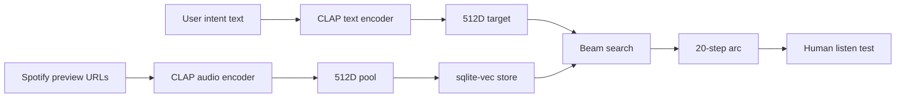

# Woody — CLAP Arc Engine Build Plan

## Premise

The previous Claude session produced the right artifacts:
- [WOODY_BUILD_SPEC.md](WOODY_BUILD_SPEC.md) — complete 1200+ line technical spec
- [.cursor/rules/woody-engine.mdc](.cursor/rules/woody-engine.mdc) — fully rewritten for CLAP, will auto-attach to all engine work
- [MASTER_BUILD_PROMPT.md](MASTER_BUILD_PROMPT.md) Section 2 + 6 annotated as display-only
- [SESSION_NOTES.md](SESSION_NOTES.md) — 3 architecture decision entries

The "infrastructure is faulty" instinct is partly right and partly overcorrection. The **engine** is faulty (4-dim heuristics in `lib/acoustic.ts`, no CLAP, no arc, no 5D). The **surrounding scaffolding** (OAuth, Spotify search, LLM intent parsing for search seeds, Librosa features) is reusable. Plan is surgical replacement of the engine, parallel new routes, zero changes to the globe UI until the engine is proven.

---

## Stage 0 — Preflight (you, manual, 30 min, NO code yet)

**The keep/rebuild/deprecate inventory is already decided** (see below). Stage 0 is not an audit — it is a sequence of go/no-go checks that can kill the entire plan before any time is spent. Do these in order. If any fails, stop and resolve before proceeding.

### 0.1 — Spotify preview_url availability (HARD GATE — first 10 minutes)
Spotify has been phasing out `preview_url` for new app registrations. Without preview URLs, the audio embedding pipeline has no input — Steps 1.2 and 1.3 are dead before they start.

```bash
# Get a client credentials token using existing app
curl -X POST https://accounts.spotify.com/api/token \
  -H "Content-Type: application/x-www-form-urlencoded" \
  -d "grant_type=client_credentials&client_id=$SPOTIFY_CLIENT_ID&client_secret=$SPOTIFY_CLIENT_SECRET"

# Test preview_url on a known track (Bohemian Rhapsody)
curl -s "https://api.spotify.com/v1/tracks/3z8h0TU7ReDPLIbEnYhWZb" \
  -H "Authorization: Bearer $TOKEN" | jq '.preview_url'
```

| Result | Action |
|--------|--------|
| non-null URL | Proceed to 0.2 |
| `null` | **Fallback required.** Either: (a) request preview_url access from Spotify (slow), (b) pivot audio input to Essentia.js client-side analysis on user-uploaded audio, (c) source audio from YouTube/SoundCloud via existing scaffolding. Re-plan Steps 1.2 + 1.3 around chosen source before continuing. |

### 0.2 — Infra prereqs (15 min)
- Python 3.11+ venv in `packages/acoustic-service/` ready (CLAP needs torch — confirm `pip install torch` succeeds on this Windows box, or plan to embed only on Modal)
- `modal token new` run, free tier confirmed (Modal credit needed for T4 GPU usage in Step 1.4)
- `ACOUSTIC_SERVICE_URL=http://localhost:8001` added to `.env.local` for local dev
- ffmpeg installed (required by librosa for MP3 decode of preview URLs) — `ffmpeg -version` returns non-empty

### 0.3 — Probe corpus verification (5 min)
[WOODY_BUILD_SPEC.md](WOODY_BUILD_SPEC.md) Section 6 lists 8 probe track IDs. Before Step 2.4 trusts them as a basis for territory centroid:
- Resolve each ID via Spotify API (`/v1/tracks/{id}`) — confirm all 8 are still available
- Note any that return 404 or are non-playable in your market — these need replacement before Step 2.4

(Full embedding-space-spanning validation happens inside Step 2.4 once CLAP is live.)

### 0.4 — Inventory lock (predetermined, do not re-audit)

**Keep as-is** (do not touch):
- `app/api/auth/**`, `lib/auth/**`, `lib/spotify.ts` — OAuth + Spotify wrapper, working
- Spotify search path in `lib/intent.ts` (PersonaLens generation, `searchQueries`, `artistSeeds`)
- `components/map/WoodyMap.tsx`, `components/screens/HomeScreen.tsx`, all UI components
- `app/api/intent/route.ts` — powers globe, leave running
- `lib/memory.ts` (territory centroid hooks — reusable for CLAP probe)
- `packages/acoustic-service/service.py` Librosa endpoint — repurpose as Layer 1 `/features/audio`
- Updated cursor rules, WOODY_BUILD_SPEC, MASTER_BUILD_PROMPT, SESSION_NOTES

**Rebuild** (new files, not in-place rewrites):
- `packages/acoustic-service/` — add CLAP service alongside existing Librosa code
- `lib/acousticService.ts` — new TS client for CLAP service (replaces `lib/acoustic.ts` 4-dim functions for navigation purposes only)
- `app/api/arc/route.ts` — new endpoint, parallel to `/api/intent`
- `lib/arcShape.ts` — new

**Mark deprecated** (annotate, do not delete):
- `lib/acoustic.ts` 4-dim functions (`acousticTarget`, `acousticScore`, `rankByAcoustic`, `AcousticTarget` type) — leave callable for `/api/intent` + globe; arc engine never uses them
- `lib/types.ts` `AcousticFeatureVector` (Librosa shape) — keep, but add `CLAPEmbedding` + `AcousticCoords5D` per spec

---

## Stage 1 — Phase 0: Engine bedrock (1-2 days, no Next.js changes)

**Goal:** A Python CLAP service running locally that produces real arcs you can listen to. The only quality gate.



### Step 1.1 — Local CLAP service (Opus-thinking, 1 Cursor session)
**Beam search implementation lives in this step** — the interaction of arc shapes, coherence relaxation schedule, and frisson positioning is the non-obvious reasoning that justifies Opus. Routers and CLAPService class are mechanical; arc.py is not.

Scaffold `packages/acoustic-service/` per [WOODY_BUILD_SPEC.md](WOODY_BUILD_SPEC.md) Section 3:
- Add to `requirements.txt`: `torch`, `transformers`, `sqlite-vec`, keep existing librosa
- New `services/clap_service.py` with `CLAPService` class — `embed_text()`, `embed_audio()`, `embed_audio_batch()`, all L2-normalised
- New `routers/embed.py` — `POST /embed/text`, `/embed/audio`, `/embed/audio/batch`
- New `routers/arc.py` — `POST /arc/generate` (beam search per spec Section 3.4) **← Opus-grade reasoning required here**
- New `routers/projection.py` — `POST /5d/project` (heuristic, display-only, per `woody-engine.mdc`)
- Update `service.py` (or new `main.py`) with lifespan handler — load CLAP once on startup
- Keep existing `/analyze` Librosa endpoint as `/features/audio` (Layer 1)

**Acceptance:** `uvicorn main:app --port 8001` starts in <60s. `curl POST /embed/text {"text":"late night drive"}` returns 512D float array in <100ms (after warm).

### Step 1.2 — Seed corpus + sqlite-vec (Composer-fast, 1 session)
Per [WOODY_BUILD_SPEC.md](WOODY_BUILD_SPEC.md) Section 4:
- `db/schema.sql` — `track_embeddings` table + `vec_tracks` virtual table
- `db/init_db.py` — installs sqlite-vec extension, runs schema
- `scripts/seed_corpus.py` — pulls ~500 tracks via existing Spotify client across diverse genres/energy, embeds each via CLAP, stores

**Acceptance:** sqlite-vec database has ~500 rows. `SELECT * FROM vec_tracks WHERE clap_vec MATCH ? AND k = 5` returns 5 nearest neighbours.

### Step 1.3 — Listen test script (Composer-fast, 1 session)
**This is the only real quality gate.** Script orchestration is mechanical (the reasoning was in 1.1's beam search). Composer-fast is sufficient — the deep thinking happens when you listen and diagnose.

- `scripts/test_arc.py` — runs 4 arc shapes against 3 intents each
- Prints: track titles, transition cosine distances, frisson positions, dimension-level diagnostics
- Asserts: all transition distances < 0.35 (or relaxed per beam search fallback)
- Outputs Spotify track URLs so you can play the arc
- Logs diagnostic markers per the failure-mode diagnosis section below

**Acceptance — measurable:**
- All consecutive distances < 0.35 (relaxable)
- Final step within 0.20 cosine of target
- Frisson tracks at 30%/65%/85% have observable density spike vs preceding 3 tracks

**Acceptance — human (non-negotiable, you do this):**
- Play journey arc ("late night drive") — does it feel like it moved over 20 tracks?
- Play plateau ("deep work no lyrics") — does it lock in without drift?
- Play discharge ("processing something heavy") — does it stay congruent for first third?
- Play peak_early ("morning run") — peak at track ~8 feel earned, descent natural?

**If listen test fails: STOP. Do not proceed to Phase 1.** Iterate on CLAP integration, distance metric, or arc shape inference until arcs are musically coherent.

### Step 1.4 — Modal deployment (Composer-fast, parallel with 1.3)
Update `packages/acoustic-service/modal_app.py` to include CLAP dependencies + GPU spec:
- `image` adds `torch`, `transformers`, `sqlite-vec`
- `@app.function(gpu="T4", ...)` — T4 GPU for CLAP inference, idle-down after 2 min
- Same FastAPI app, mounted on Modal
- Output: `https://<workspace>--woody-acoustic-clap.modal.run`

**Acceptance:** Parity test — same intent text returns embeddings with cosine similarity > 0.9999 vs local output (use cosine similarity, not element-wise diff — GPU/CPU float precision differs legitimately).

---

## Stage 2 — Phase 1: Next.js integration (3-5 days, after listen test passes)

### Step 2.1 — TS client (Composer-fast)
`lib/acousticService.ts` per [WOODY_BUILD_SPEC.md](WOODY_BUILD_SPEC.md) Section 5:
- `AcousticServiceClient` class
- `embedText`, `embedAudioBatch`, `generateArc`, `isEnabled()`
- Reads `ACOUSTIC_SERVICE_URL` env var
- Add types to `lib/types.ts`: `CLAPEmbedding`, `ArcStep`, `AcousticCoords5D`, `ArcShape`, `ArcResult`

### Step 2.2 — New arc route (Opus-thinking, 1 session)
`app/api/arc/route.ts` — POST endpoint, parallel to `/api/intent`, **not a replacement**:
- Parallel: `embedText(intent)` + existing `intentToSuggestions()` from `lib/intent.ts`
- Use PersonaLens to populate candidate pool via existing Spotify search
- Batch CLAP-embed all pool tracks
- Call `generateArc()` with target embedding + arc shape inferred from `lib/arcShape.ts`
- Return arc steps with full track metadata

`lib/arcShape.ts` (new):
- `inferArcShape(intentText): ArcShape` per signal arrays in [woody-engine.mdc](.cursor/rules/woody-engine.mdc)

### Step 2.3 — Intent route augment (Composer-fast)
Modify `app/api/intent/route.ts` — **add only, do not remove**:
- Add `targetEmbedding: number[]` to response (CLAP text embed of intent)
- Existing `personaLens` + `suggestions` keep working (globe stays functional)

### Step 2.4 — Probe cold start (Composer-fast, 1 session)
Per [WOODY_BUILD_SPEC.md](WOODY_BUILD_SPEC.md) Section 6:
- `app/api/probe/route.ts` — GET returns 8 probe tracks, POST accepts signal
- `lib/coldStart.ts` — `computeTerritoryFromProbe(signals)` returns 512D centroid
- Signal weights: replay=3.0, save=4.0, listen_through=1.0, skip_late=-0.5, skip_early=-1.5, skip_immediate=-2.5

**Mandatory validation gate (inside this step, before merge):**
- `scripts/validate_probes.py` — embeds all 8 probe tracks via CLAP, computes pairwise cosine distances
- Assert: **all 28 pairwise distances > 0.30**
- If any pair < 0.30: replace with a track from an unrepresented acoustic region before shipping

### Step 2.5 — Smoke test (you, in browser/curl, 30 min)
1. `POST /embed/text {"text": "late night drive"}` → 512D array
2. `POST /arc/generate` with 5-track pool → ordered steps
3. `POST /api/arc {"intent": "study session no lyrics"}` → ArcResult
4. All transition cosine distances < 0.35
5. Run anti-slop checklist (below)

---

## Anti-slop checklist (mandatory before accepting any agent-generated file)

1. Distance function operates on 512D vectors, not 5D coords
2. `recommend` / `recommendation` / `suggestion` absent from all navigation code paths (search-only OK in PersonaLens)
3. Agent did not re-propose anything in [SHELVED.md](SHELVED.md) (A*, 5D Euclidean for nav, LLM prompt eng for calibration, JEPA, Spotify history as primary cold start)
4. Beam search maintains `beam_width > 1` candidates per step
5. Skip handling distinguishes <15% / 15-70% / >70% as three separate cases
6. PersonaLens used only in search query path, not in distance/navigation path
7. CLAP embeddings L2-normalised before storage

**If any fail: delete the file and regenerate with the relevant [WOODY_BUILD_SPEC.md](WOODY_BUILD_SPEC.md) section pasted directly into the Cursor composer.**

---

## Listen test failure diagnosis (use if Step 1.3 quality gate fails)

| Failure mode | Diagnostic signal | Fix location |
|---|---|---|
| **A. CLAP embeddings wrong** | Same text embedded twice → different vectors; or norm ≠ 1.0 | `services/clap_service.py` — L2 norm, model.eval(), load once |
| **B. Beam search is greedy** | Final coverage same regardless of beam_width param | `routers/arc.py` — verify width > 1 maintained at each step |
| **C. Corpus not diverse** | k-NN returns same tracks across all arc shapes | `scripts/seed_corpus.py` — expand, audit genre/energy spread |
| **D. Arc shape not firing** | All intents produce identical waypoint progressions | `routers/arc.py` — log inferred shape per request, check signal matching |
| **E. Frisson ignored** | Tracks at 30/65/85% same energy as preceding 3 | `routers/arc.py` — frisson weighting must override pure k-NN at those positions |

**Diagnosis order: A → B → E → D → C.** A and B are cheap infrastructure bugs. C is expensive (re-seeding). Never guess — read the script output.

**Required script output per run:**
- Per embed call: norm, dimensionality, reproducibility hash
- Per arc step: candidates before/after coherence filter, selected track's rank
- Per arc: inferred shape, frisson positions hit (y/n), final cosine distance to target

---

## Cursor execution mapping

| Stage | Model | Depends on | Prompt |
|-------|-------|------------|--------|
| 0 Preflight | manual | — | Run checks. NO code. |
| 1.1 CLAP service | **Opus thinking** | 0 | `@WOODY_BUILD_SPEC.md Section 3. Scaffold CLAP service + beam search alongside existing service.py. beam_width > 1 enforced.` |
| 1.2 Seed corpus | Composer-fast | 1.1 running | `@WOODY_BUILD_SPEC.md Section 4. db/schema.sql, init_db.py, seed_corpus.py. ~500 tracks, explicit genre+energy diversity.` |
| 1.3 Listen test | Composer-fast | 1.2 | `@WOODY_BUILD_SPEC.md Section 15. scripts/test_arc.py. Real embeddings, no mocks. Output distinguishes failure modes A-E.` |
| 1.4 Modal deploy | Composer-fast | 1.1 (∥ 1.3) | `Update modal_app.py: CLAP image + T4 GPU. Parity: cosine_sim(local, modal) > 0.9999.` |
| 2.1 TS client | Composer-fast | gate passed | `@WOODY_BUILD_SPEC.md Section 5. lib/acousticService.ts + types. @deprecated on lib/acoustic.ts nav functions.` |
| 2.2 Arc route | **Opus thinking** | 2.1 | `@WOODY_BUILD_SPEC.md Section 5. app/api/arc/route.ts + lib/arcShape.ts. Parallel to /api/intent, not replacing it.` |
| 2.3 Intent augment | Composer-fast | gate (∥ 2.1) | `app/api/intent/route.ts: ADD targetEmbedding only. Touch nothing else.` |
| 2.4 Probe cold start | Composer-fast | 2.2 | `@WOODY_BUILD_SPEC.md Section 6. probe/route.ts + coldStart.ts + validate_probes.py. Pairwise gate > 0.30.` |

---

## What this plan deliberately defers

- 5D linear probe Ridge regression (Phase 2)
- Acoustic field canvas as React component
- Globe UI rework
- MuQ-MuLan / MERT A/B (only if CLAP listen test underperforms)
- Anything in [SHELVED.md](SHELVED.md)
